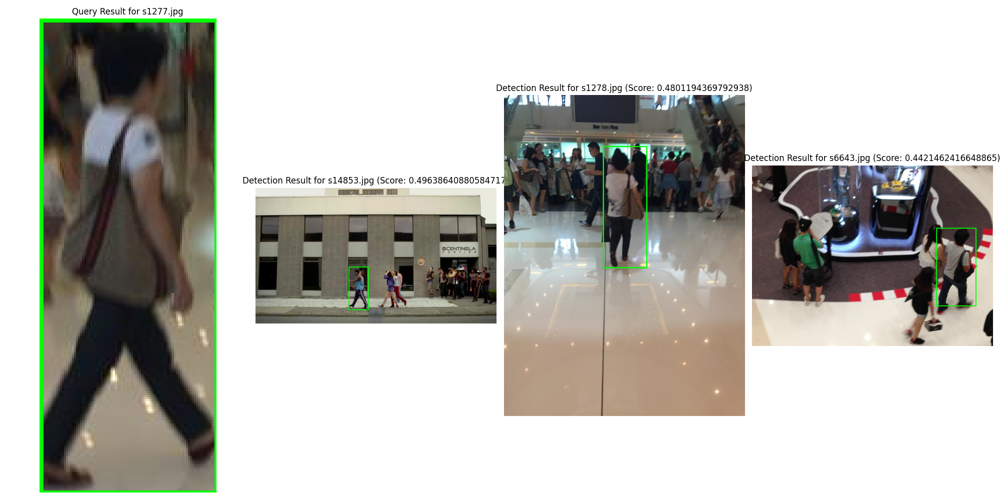
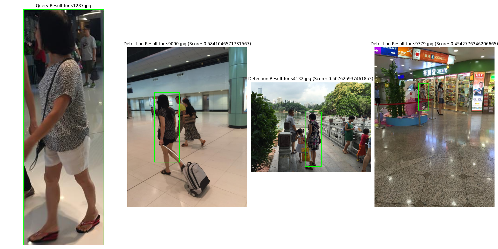
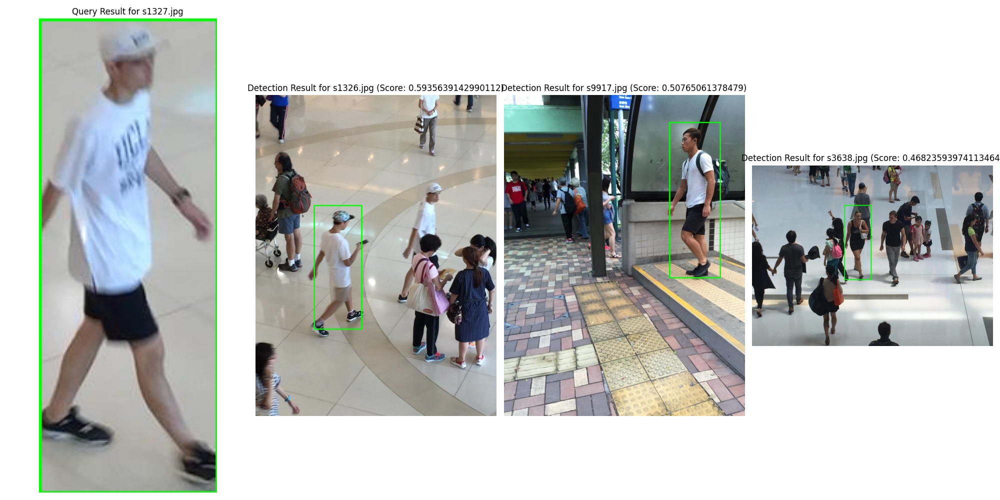
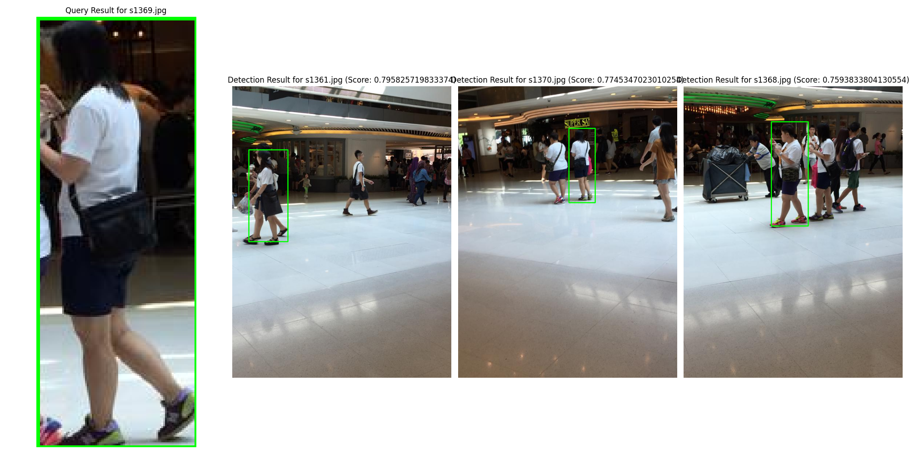

# Algorithm-Replication-DDAM-PS
original is https://github.com/mustansarfiaz/DDAM-PS/blob/main/README.md

 
click here to find my understanding of this project
 
https://mud-passbook-be4.notion.site/DDAM-PS-7000b55adaeb4cc7b28ae12bbc223302

  
Given the data size consideration, only the main code files are uploaded here, without the datasets, checkpoints, and generated detection result images.

  
quickly see the Re_ID results

